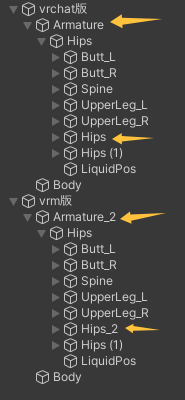

# VRM样式骨骼重命名工具 使用文档

## 概述
**VrmLikeBoneRenamer** 是一个 Unity Editor 小工具，用于在导出 VRM 之前，将**非 Humanoid 骨骼**的**重名节点**按 **VRM 导出器相同规则**重命名：  
- 保留 Humanoid 骨骼原名；  
- 对其余与他人**同名**的节点，从 `_2` 开始依次试到 `_4999`，找到未占用的名字即改名（如 `Head` → `Head_2`、`Head_3` …）。  
- 与 `VRMEditorExporter` 中的 `ForceUniqueName` 行为一致。

## 适用场景
- 合并多个模型后层级内存在**重复的 Transform 名称**；  
- VRM 导出时会自动重命名，想使用复制工具一键复制**Physbone等组件**但骨骼名称已改变；  
- 需要**批处理修正**重名但**不影响** Humanoid 骨骼映射。

## 环境要求
- Unity（与 UniVRM 使用版本保持一致即可）  
- 项目内安装了 **UniVRM**（用于导出 VRM，工具本身不强依赖）  

## 导入安装
在Releases下载UnityPackage并导入。

## 手动安装
1. 将脚本保存为：`Assets/Editor/VrmLikeBoneRenamer.cs`  
2. 回到 Unity，等待脚本编译完成。

## 菜单位置 & 快捷键
- 菜单：**`Tools → Make Bone Names Unique (VRM-style)`**  
- 快捷键：`Ctrl/Cmd + Shift + U`（可在脚本里修改或移除）

## 使用步骤
1. 在 **Hierarchy** 中**选中**你的**模型根节点（root）**。  
2. 确认 **root 节点上挂有 Animator**，且 **Avatar 为 Humanoid**。  
3. 点击菜单 **Tools → Make Bone Names Unique (VRM-style)**。  
4. 弹窗提示：  
   - **未选中对象** → “没有选中任何对象”；  
   - **root 上没有 Humanoid Animator** → “无法执行重命名”；  
   - **处理完成** → 显示本次**重命名的节点数量**。

## 行为说明（与 VRM 导出一致）
- 仅在**所选 root 的层级**内统计同名（一次性统计 `name → count`），并据此判定是否需要改名；  
- **Humanoid 骨骼始终保持原名**（以 root 上 Animator 的 `HumanBodyBones` 映射为准）；  
- 对于重名的其他节点，从 `_2` 到 `_4999` 依次尝试新的名字；  
- 支持 **Undo**（用 `Undo.RecordObject` 记录了改名操作）。

## 典型结果
- 层级中有两个 `Head`：  
  - 若第一个是 Humanoid 的 `Head`，它**保留**原名；  
  - 另一个会被改为 `Head_2`；  
- 常见 Humanoid 骨骼如 `Hips/Spine/Chest/Neck/Head` 等在 root 上有 Humanoid Animator 时**不会被改名**。

## 常见问题（FAQ）
**Q1：我执行后 Humanoid 骨骼也被改名了？**  
- 多半是 **root 上没有 Humanoid Animator**（或 Avatar 不是 Humanoid）。工具会弹窗提示并**不执行**。  

**Q2：我的 Animator 挂在子节点上怎么办？**  
- 本工具**特意与 VRM 导出保持一致**：**只看 root 上是否有 Animator**。如果需要“自动在子层里查找”，可改成 `GetComponentInChildren<Animator>()`（刻意没有启用这个，以免与 VRM 行为不一致）。  

**Q3：我想在没有 Animator 的情况下也强制改名？**  
- 可加第二个“强制模式”菜单项，跳过 Humanoid 检测，直接对全部重复节点重命名。  

**Q4：能否只处理某些前缀/路径下的节点？**  
- 可以，在遍历时加自定义过滤（例如只处理 `Armature` 下的节点），但会偏离 VRM 原始行为。  

## 故障排查
- **菜单不显示**：确认脚本文件位于 `Assets/Editor/`；  
- **没有任何改名**：层级内可能没有重复名称，或 root 上无 Humanoid Animator（弹窗会提示）；  
- **改名后引用断裂**：一般不会影响 SkinnedMeshRenderer 的 `bones` 引用，但若你脚本/动画通过字符串查找节点名，需同步更新。

## 安全性与回滚
- 所有改名都记录了 **Undo**，可通过 `Edit → Undo` 回退；  
- 建议在**场景/Prefab 的备份分支**上操作。

## 代码入口（摘要）
- 菜单入口：`Tools/Make Bone Names Unique (VRM-style)`  
- 关键逻辑：  
  - 检查选中与 root 上 Animator；  
  - 收集 Humanoid 映射骨骼并**排除**；  
  - 统计 `nameCount` 并对**非 Humanoid**重复者执行 `ForceUniqueName`（从 `_2` 起试到 `_4999`）。
